# VocaLink
### Augmentative and Alternative Communication (AAC) Platform for Nonverbal Students

---

## 1. Project Description

VocaLink is a capstone project built for **Special Needs Education (SNED)** classrooms. It is designed to empower nonverbal students to communicate seamlessly with their teachers through AAC (Augmentative and Alternative Communication) technology.

The system provides an **AAC icon board**, **LSTM-based next-icon prediction**, **live closed captioning** powered by Whisper speech-to-text, **session management**, and **email-verified accounts**. It consists of three interconnected components: a React web application for teachers, an Expo React Native mobile application for nonverbal students, and a FastAPI backend server that serves both the core REST API and the ML prediction layer.

---

## 2. Features

- **AAC Board** — Nonverbal students tap symbol icons (24 icons across 4 categories: Needs, Emotions, Classroom, Actions) to build and send messages to their teacher
- **LSTM Next-Icon Prediction** — AI-powered suggestion bar that predicts the next 3 most likely icons the student will tap, based on their personal history and global usage patterns
- **Live Closed Captioning (Live CC)** — Teacher's spoken words are transcribed in real time using the Web Speech API and displayed to students; all CC messages are stored in the session log
- **Session Management** — Teacher starts and ends classroom sessions; the AAC board auto-locks/unlocks based on whether a session is active
- **Text-to-Speech (TTS)** — Students can have their built AAC message spoken aloud via `expo-speech`
- **Whisper Speech-to-Text** — Backend `/api/stt/` endpoint powered by the custom Whisper model (`rammealz123/VOCALink-Mobile-STT`) on HuggingFace
- **Email Verification** — Secure account creation with 6-digit OTP sent via Brevo transactional email API
- **Forgot Password** — 3-step OTP-based password reset flow (request → verify code → set new password)
- **Student Management** — Teachers can assign students to their class and monitor their presence and activity
- **Real-time Polling** — Dashboard and Live CC poll the backend every 3–4 seconds for live updates (replaces WebSocket which is unavailable on Render free tier)
- **Online Presence Tracking** — Students' `last_seen` timestamp is updated every 30 seconds; teacher sees who is currently online
- **Haptic Feedback** — Phone vibrates on every AAC icon tap for tactile confirmation (`expo-haptics`)
- **Role-based Access** — TEACHER accounts access the web dashboard; STUDENT accounts access the mobile app

---

## 3. Technology Stack

### 3.1 Web Application

| Field | Detail |
|---|---|
| **Project name** | vocalink-web |
| **Framework** | React 19 + TypeScript (Vite) |
| **Build tool** | Vite — `npm run dev` / `npm run build` |
| **Key pages** | Login, Signup, Forgot Password, Verify Email, Dashboard, Broadcast, Live CC, Students, Messages, Settings |
| **Speech-to-text** | Web Speech API (`SpeechRecognition` / `webkitSpeechRecognition`) — Chrome/Edge only |
| **Charts** | Recharts — student activity and AAC usage analytics |
| **Routing** | React Router DOM v7 |
| **State / context** | `AuthContext.tsx` — JWT auth state, login/logout/signup |
| **API calls** | `services/api.ts` — Axios instance pointing to FastAPI at `https://vocalink-fastapi.onrender.com/api` |
| **Deployment** | GitHub Pages via `gh-pages` |

### 3.2 Mobile Application

| Field | Detail |
|---|---|
| **Project name** | vocalink-mobile |
| **Framework** | React Native — Expo SDK ~54.0.33 |
| **Run commands** | `npx expo start` |
| **Key screens** | Home (student), Home (teacher), AAC Board, Live CC, Profile, Edit Profile, Login, Signup, Verify Email, Forgot Password |
| **Navigation** | Bottom nav — Home 🏠, AAC Board 🗣️, Live CC 📝, Profile 👤 |
| **LSTM Prediction** | `board.tsx` calls `POST /api/predict-next/` — shows ✨ Suggested Next [LSTM] bar |
| **Text-to-Speech** | `expo-speech` — speaks the AAC message aloud when student taps Speak |
| **Haptics** | `expo-haptics` — vibration feedback on every icon tap |
| **State / context** | `AuthContext.tsx` (JWT auth), `ThemeContext.tsx` (light/dark theme) |
| **Secure storage** | `expo-secure-store` — stores JWT token securely on device |
| **API calls** | `constants/api.ts` — `API_BASE_URL = https://vocalink-fastapi.onrender.com/api` |

### 3.3 Backend — FastAPI

| Field | Detail |
|---|---|
| **Framework** | FastAPI — Python + Uvicorn |
| **Run command** | `uvicorn main:app --reload --host 0.0.0.0 --port 8000` |
| **Live URL** | `https://vocalink-fastapi.onrender.com` |
| **API prefix** | `/api` |
| **Swagger docs** | `https://vocalink-fastapi.onrender.com/docs` |
| **Database** | PostgreSQL on Render (SQLAlchemy ORM) |
| **Auth** | JWT (PyJWT) + bcrypt password hashing (passlib) |
| **Core routers** | `/auth`, `/profile`, `/sessions`, `/logs`, `/cc`, `/broadcast`, `/presence`, `/teacher`, `/users` |
| **ML routers** | `/predict-next`, `/stt` |

### 3.4 ML Layer

The ML layer is embedded inside the FastAPI backend. The LSTM-style prediction model runs at request time using the user's stored `AACLog` history from the PostgreSQL database.

| Field | Detail |
|---|---|
| **LSTM Prediction endpoint** | `POST /api/predict-next/` |
| **Whisper STT endpoint** | `POST /api/stt/` |
| **Prediction input** | `{ "sequence": ["water", "please"], "top_k": 3 }` |
| **Prediction output** | `{ "predictions": ["thankyou", "yes", "teacher"], "source": "lstm-bigram", "confidence": [0.45, 0.35, 0.20] }` |
| **Whisper model** | `rammealz123/VOCALink-Mobile-STT` on HuggingFace |
| **Why HuggingFace** | Whisper requires ~1–2GB RAM + GPU; Render free tier provides 512MB and no GPU |

### 3.5 Database

| Field | Detail |
|---|---|
| **Engine** | PostgreSQL (hosted on Render) |
| **ORM** | SQLAlchemy |
| **Tables** | `users`, `teacher_profiles`, `student_profiles`, `class_sessions`, `cc_messages`, `aac_logs` |

---

## 4. ML Models

### 4.1 LSTM Next-Icon Prediction

| Property | Detail |
|---|---|
| **Type** | Sequence-based bigram transition model (LSTM-style) |
| **Used in** | Mobile App — AAC Board (✨ Suggested Next bar) |
| **Endpoint** | `POST /api/predict-next/` |
| **Input** | List of icon IDs the student has tapped in the current sequence |
| **Output** | Top 3 predicted next icons with confidence scores |
| **Cold start** | Default suggestions: Water 💧, Help ✋, Teacher 👩‍🏫 |

**How it works — 3-source weighted scoring:**

| Source | Weight | Description |
|---|---|---|
| Personal history | 2x | Bigram transitions from the student's own AACLog (last 500 taps) |
| Global usage | 1x | What all users across the system tap after this icon (last 2,000 logs) |
| Linguistic prior | 0.5x | Hand-curated common AAC phrase transitions for new users (cold start) |

**Example transitions (linguistic prior):**

| After tapping... | Suggested next |
|---|---|
| 💧 Water | 🙏 Please → 🙏 Thank you → ✅ Yes |
| ✋ Help | 🙏 Please → 👩‍🏫 Teacher → ❓ Question |
| 😊 Happy | 🙏 Thank you → ✅ Yes → 👩‍🏫 Teacher |
| 😠 Angry | 🛑 Stop → ✋ Help → ❌ No |

The more the student uses the app, the more their personal history dominates — making predictions increasingly personalized over time.

### 4.2 Whisper Speech-to-Text

| Property | Detail |
|---|---|
| **Model name** | `rammealz123/VOCALink-Mobile-STT` |
| **Base model** | OpenAI Whisper |
| **Hosted on** | HuggingFace Inference API |
| **Used in** | Web App — teacher's speech transcribed to live captions for students |
| **Endpoint** | `POST /api/stt/` |
| **Input** | Audio file (WAV/MP3) uploaded from the browser |
| **Output** | Transcribed text string |

---

## 5. APIs & External Services

### Brevo Transactional Email API
- **Purpose:** Sends 6-digit OTP verification codes during signup and password reset
- **Used in:** Backend → `/api/auth/register/` and `/api/auth/forgot-password/`
- **Endpoint:** `POST https://api.brevo.com/v3/smtp/email`
- **Auth:** `api-key` header via `BREVO_API_KEY` environment variable
- **Why Brevo:** Render free tier blocks outbound SMTP ports (25, 465, 587). Brevo uses HTTPS port 443. Free tier: 300 emails/day.

### HuggingFace Inference API
- **Purpose:** Runs the Whisper STT model to transcribe teacher's speech
- **Model:** `rammealz123/VOCALink-Mobile-STT`
- **Endpoint:** `POST https://api-inference.huggingface.co/models/rammealz123/VOCALink-Mobile-STT`
- **Auth:** Bearer token via `HUGGINGFACE_TOKEN` environment variable

### Web Speech API (Browser Built-in)
- **Purpose:** Real-time speech recognition for teacher's live captioning in the web app
- **Used in:** `Broadcast.tsx` — teacher speaks → Chrome transcribes → sent as CC message
- **Note:** Chrome and Edge only. No API key needed.

### JWT (JSON Web Tokens)
- **Purpose:** Stateless authentication across all API requests
- **Library:** PyJWT (backend), stored via `expo-secure-store` (mobile), `localStorage` (web)
- **Algorithm:** HS256 — signed with `SECRET_KEY` environment variable

---

## 6. System Architecture

```
┌────────────────────────────┐       ┌──────────────────────────────┐
│   WEB APP — Teacher        │       │  MOBILE APP — Student        │
│   React + Vite + TypeScript│       │  Expo / React Native         │
│   GitHub Pages             │       │  Expo Go (Android / iOS)     │
│                            │       │                              │
│  Dashboard                 │       │  Home Screen                 │
│  Broadcast (STT + Session) │       │  AAC Board + LSTM Predict    │
│  Live CC (session logs)    │       │  Live CC (view captions)     │
│  Students Management       │       │  Profile                     │
│  Messages                  │       │                              │
│  Settings                  │       │                              │
└──────────┬─────────────────┘       └──────────────┬───────────────┘
           │  HTTPS REST (JWT Bearer)               │  HTTPS REST (JWT Bearer)
           ▼                                        ▼
┌──────────────────────────────────────────────────────────────────┐
│                  BACKEND — FastAPI on Render                      │
│             https://vocalink-fastapi.onrender.com                │
│                                                                  │
│  /api/auth      — register, login, verify-email, forgot-password │
│  /api/profile   — get/update/delete profile                      │
│  /api/sessions  — toggle, get active, session logs               │
│  /api/logs      — AAC icon tap logs                              │
│  /api/broadcast — teacher broadcasts CC message                  │
│  /api/cc        — get CC messages for session                    │
│  /api/presence  — student last_seen heartbeat                    │
│  /api/teacher   — manage students, view all logs                 │
│  /api/predict-next — LSTM next-icon prediction (ML)              │
│  /api/stt       — Whisper speech-to-text (ML)                    │
│                                                                  │
└───────┬─────────────────────────┬────────────────────────────────┘
        │                         │
        ▼                         ▼
┌───────────────┐       ┌──────────────────────────────────────┐
│  PostgreSQL   │       │  External Services                   │
│  (Render)     │       │                                      │
│               │       │  HuggingFace — Whisper STT model     │
│  users        │       │  Brevo — OTP email delivery          │
│  sessions     │       │  Web Speech API — browser STT        │
│  aac_logs     │       └──────────────────────────────────────┘
│  cc_messages  │
│  profiles     │
└───────────────┘
```

---

## 7. API Endpoints

### Authentication

| Method | Endpoint | Description |
|---|---|---|
| `POST` | `/api/auth/register/` | Register new account, sends 6-digit OTP via Brevo |
| `POST` | `/api/auth/verify-email/` | Verify email with OTP code |
| `POST` | `/api/auth/login/` | Login, returns JWT token |
| `POST` | `/api/auth/forgot-password/` | Request OTP for password reset |
| `POST` | `/api/auth/reset-password/` | Reset password with OTP |
| `GET` | `/api/auth/test-brevo/` | Debug: check Brevo configuration |

### User & Profile

| Method | Endpoint | Description |
|---|---|---|
| `GET` | `/api/users/me/` | Get current logged-in user |
| `GET` | `/api/profile/me` | Get full profile (teacher or student) |
| `DELETE` | `/api/profile/me` | Delete account |

### Sessions

| Method | Endpoint | Description |
|---|---|---|
| `POST` | `/api/sessions/toggle` | Start or end a classroom session |
| `GET` | `/api/sessions/teacher` | Get teacher's active session |
| `GET` | `/api/sessions/student` | Get student's current session (via instructor) |
| `GET` | `/api/sessions/all/` | Get all sessions for teacher |
| `GET` | `/api/sessions/{session_id}/log/` | Get full log of a session (CC + AAC taps) |

### AAC & Broadcast

| Method | Endpoint | Description |
|---|---|---|
| `POST` | `/api/logs/` | Log a student's AAC icon tap |
| `GET` | `/api/logs/` | Get student's own tap history |
| `GET` | `/api/teacher/logs/` | Get all students' tap logs (teacher) |
| `GET` | `/api/sessions/logs/` | Get logs for teacher analytics |
| `POST` | `/api/broadcast/` | Teacher broadcasts a CC message |
| `GET` | `/api/cc/messages/` | Get CC messages for current session |
| `POST` | `/api/presence/` | Student heartbeat — update `last_seen` |

### ML / AI

| Method | Endpoint | Description |
|---|---|---|
| `POST` | `/api/predict-next/` | LSTM-style next AAC icon prediction |
| `POST` | `/api/stt/` | Whisper speech-to-text — audio → transcript |

### Teacher Tools

| Method | Endpoint | Description |
|---|---|---|
| `GET` | `/api/teacher/students/` | Get teacher's assigned students |
| `GET` | `/api/users/all-students/` | Get all students (for assignment) |
| `POST` | `/api/teacher/students/{user_id}` | Assign a student to teacher |

---

## 8. Environment Variables

Set these on Render dashboard → your service → **Environment** tab:

| Variable | Required | Description |
|---|---|---|
| `DATABASE_URL` | ✅ | PostgreSQL connection string (Render provides automatically) |
| `SECRET_KEY` | ✅ | JWT signing secret — use a long random string |
| `BREVO_API_KEY` | ✅ | Brevo transactional email API key |
| `BREVO_SENDER_EMAIL` | ✅ | Verified sender email address on Brevo |
| `HUGGINGFACE_TOKEN` | ✅ | HuggingFace API token for Whisper model |

---

## 9. Installation & Setup

### Requirements
- Python 3.11+
- Node.js 18+
- Expo CLI (`npm install -g expo-cli`)
- Expo Go app on your phone (Android / iOS)

### 9.1 Backend Setup (FastAPI)

```bash
cd vocalinkfastapi/VOCALink-FastAPI

# Create virtual environment
python -m venv venv
venv\Scripts\activate          # Windows
source venv/bin/activate       # Mac/Linux

# Install dependencies
pip install -r requirements.txt

# Set environment variables
set DATABASE_URL=postgresql://...
set SECRET_KEY=your-secret-key
set BREVO_API_KEY=your-brevo-key
set BREVO_SENDER_EMAIL=your@email.com
set HUGGINGFACE_TOKEN=your-hf-token

# Run server
uvicorn main:app --reload --host 0.0.0.0 --port 8000
```

Swagger UI: `http://localhost:8000/docs`

### 9.2 Web App Setup

```bash
cd vocalinkweb/VOCALink-Web
npm install
npm run dev
```

Open: `http://localhost:5173`

### 9.3 Mobile App Setup

```bash
cd "vocalink mobile/VOCALink-Mobile"
npm install
npx expo start
```

Scan the QR code with **Expo Go** on your phone. Make sure your phone and laptop are on the same WiFi network.

---

## 10. Deployment

### Backend — Render
- **Platform:** [render.com](https://render.com) (free tier)
- **Service type:** Web Service
- **Build command:** `pip install -r requirements.txt`
- **Start command:** `uvicorn main:app --host 0.0.0.0 --port $PORT`
- **Auto-deploy:** Yes — every `git push` triggers a redeploy
- **Database:** PostgreSQL on Render (free tier, 1GB)
- **Cold start note:** Free tier spins down after 15 min of inactivity. First request after sleep may take ~30 seconds.

### Web App — GitHub Pages
```bash
npm run deploy
```
Live URL: `https://raahmmelzz.github.io/VOCALink-Rammel/`

### Mobile App — Expo Go
- Development / defense: `npx expo start` → scan QR with Expo Go
- Production build: `eas build` (requires Expo account)

---

## 11. Features by Role

### Teacher (Web App)

| Feature | Description |
|---|---|
| ✅ Register & verify email | Sign up → 6-digit OTP via Brevo → activate account |
| ✅ Forgot password | Request OTP → verify → set new password (3-step flow) |
| ✅ Dashboard | Overview: assigned students, online presence, recent AAC activity |
| ✅ Start / end session | Toggle classroom session — students' boards auto-lock/unlock |
| ✅ Live broadcast (STT) | Speak into mic → Web Speech API transcribes → CC sent to students |
| ✅ Live CC viewer | View all student AAC taps and CC messages in real time |
| ✅ Student management | Assign students to class, view profiles and status |
| ✅ Messages | View messages from students |
| ✅ Settings | Update teacher profile |

### Student (Mobile App)

| Feature | Description |
|---|---|
| ✅ Register & verify email | Sign up → 6-digit OTP via Brevo → activate account |
| ✅ Home screen | Greeting with name, session status, quick-access AAC icons |
| ✅ AAC Board | Tap 24 icons across 4 categories to build messages |
| ✅ LSTM Smart Suggestions | ✨ Suggested Next [LSTM] bar — top 3 predicted next icons |
| ✅ Speak button | Built AAC message is spoken aloud via `expo-speech` |
| ✅ Send button | Message sent to teacher via active session log |
| ✅ Live CC | View teacher's speech as live text captions |
| ✅ Session detection | Board auto-locks when no teacher session is active |
| ✅ Haptic feedback | Phone vibrates on every icon tap |
| ✅ Profile | View and edit student profile |

---


---

## 12. Deployment Link

| Platform | Link |
|---|---|
| **Web App (Teacher Dashboard)** | https://raahmmelzz.github.io/VOCALink-Rammel/ |
| **Backend API** | https://vocalink-fastapi.onrender.com |
| **API Docs (Swagger)** | https://vocalink-fastapi.onrender.com/docs |
| **Mobile APK (Android)** | Available via EAS Build — APK | https://expo.dev/artifacts/eas/i1D6m1RRahzFqPCNgZhP1v.apk

---

## 13. Test Account

| Role | Email | Password |
|---|---|---|
| **Teacher** | testteacher@vocalink.com | Test@1234 |
| **Student** | teststudent@vocalink.com | Test@1234 |

> Note: Email verification is required. If the test account is already verified, you can log in directly.

---

## 14. Team Members and Roles

| Name | Role / Modules |
|---|---|
| Olaco, Mark Aidel Ray D. | Front End Developer |
| Pacamo, Rammel | Back End Developer |
| Pantilgan, Jon Marco F. | Database Administrator |
| Rulona, Nick | Technical Writer |

---

## 15. Known Limitations

- **Render free tier cold start** — server sleeps after 15 min of inactivity; first request takes ~30 seconds to wake up
- **Web Speech API** — live captioning only works on Google Chrome or Microsoft Edge; not supported on Safari or Firefox
- **No WebSocket** — real-time updates use polling every 3–4 seconds instead of true WebSocket (Render free tier does not support persistent WebSocket connections)
- **HuggingFace cold start** — Whisper model may take 20–30 seconds on first STT call if HuggingFace has not been used recently
- **No offline support** — both web and mobile apps require an active internet connection to the backend
- **Brevo free tier** — limited to 300 emails per day (sufficient for demo/defense)
- **LSTM cold start** — first-time users have no personal history; suggestions come from the linguistic prior until enough taps are logged

---

## 16. Screenshots

### Mobile App — Login
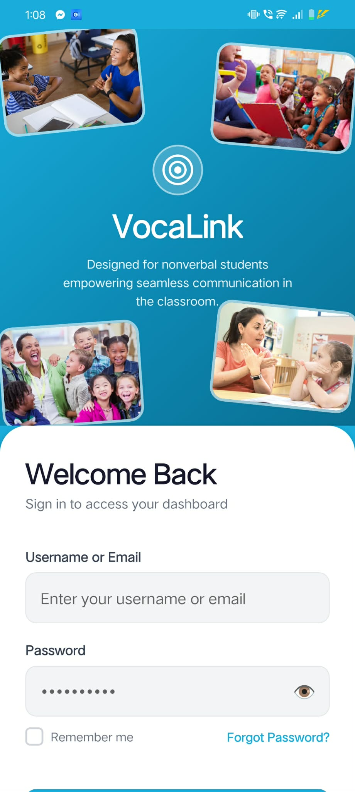

### Mobile App — Home Screen (Class is Live)
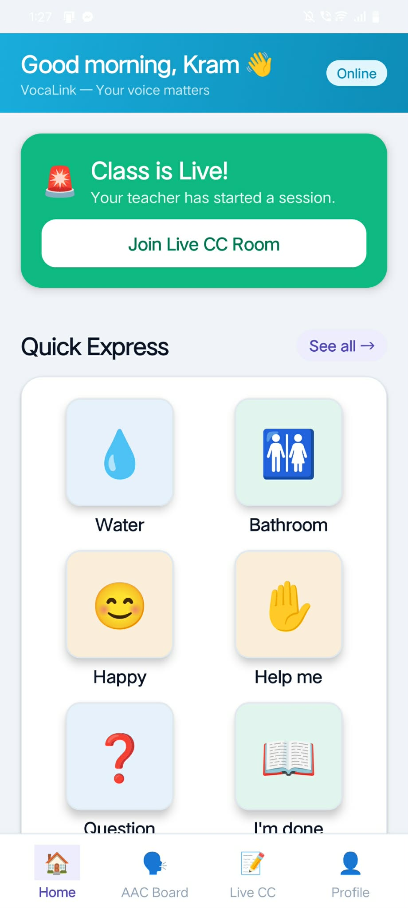

### Mobile App — AAC Board
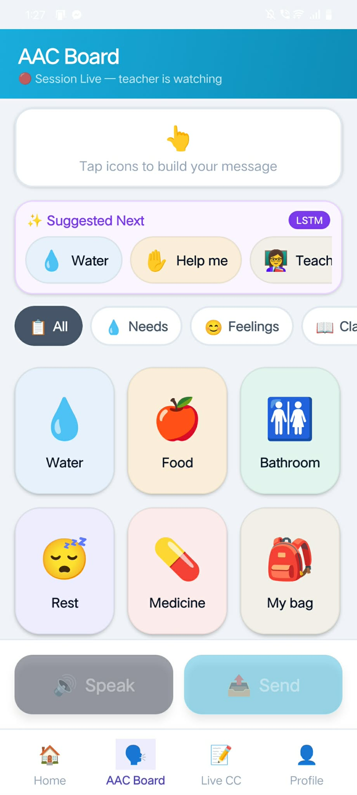

### Mobile App — Live Captions
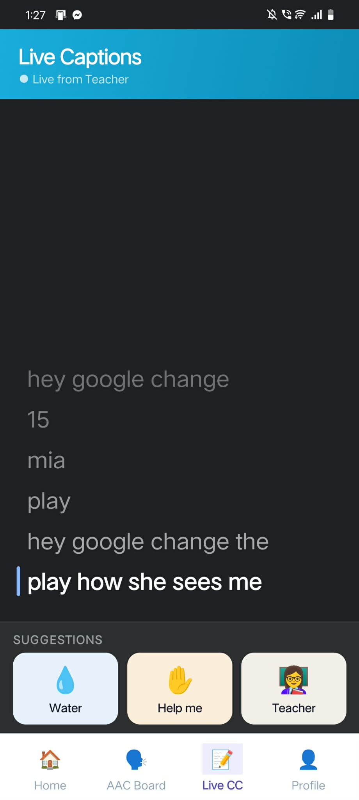

### Mobile App — Profile
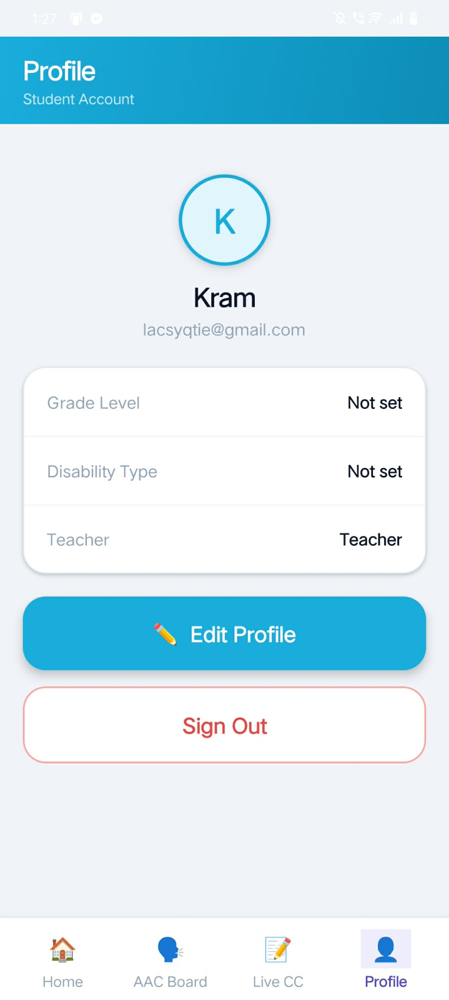

### Web App — Login
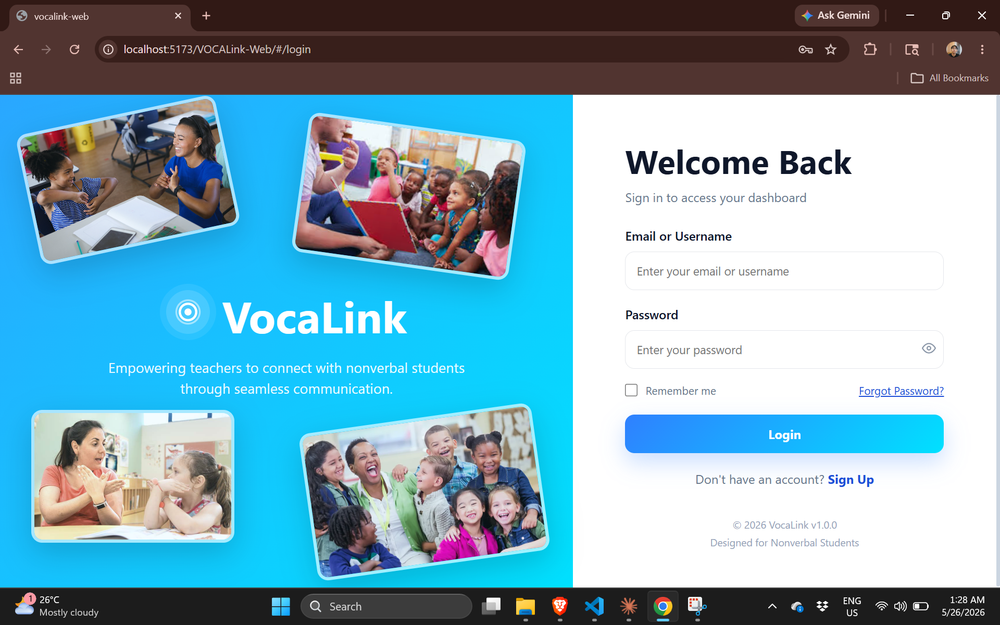

### Web App — Teacher Dashboard
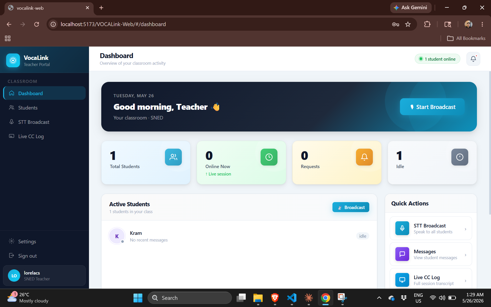

### Web App — Students
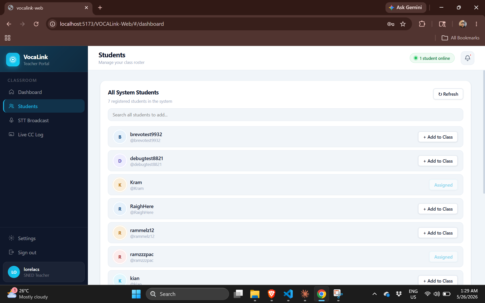

### Web App — STT Broadcast
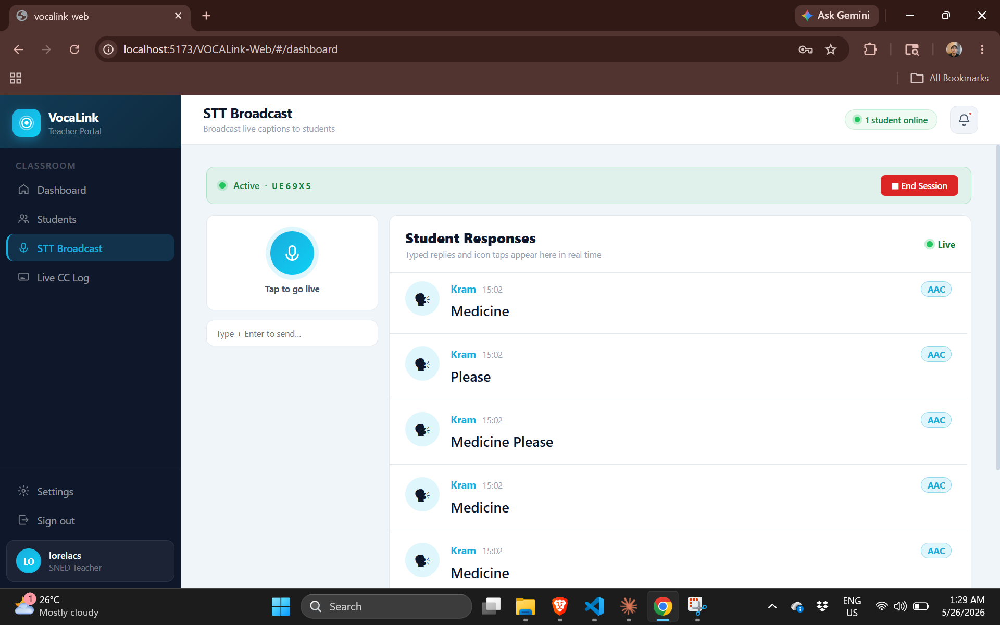

### Web App — Live CC Log
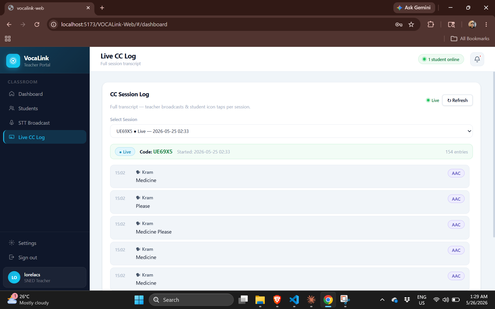

### Web App — Settings
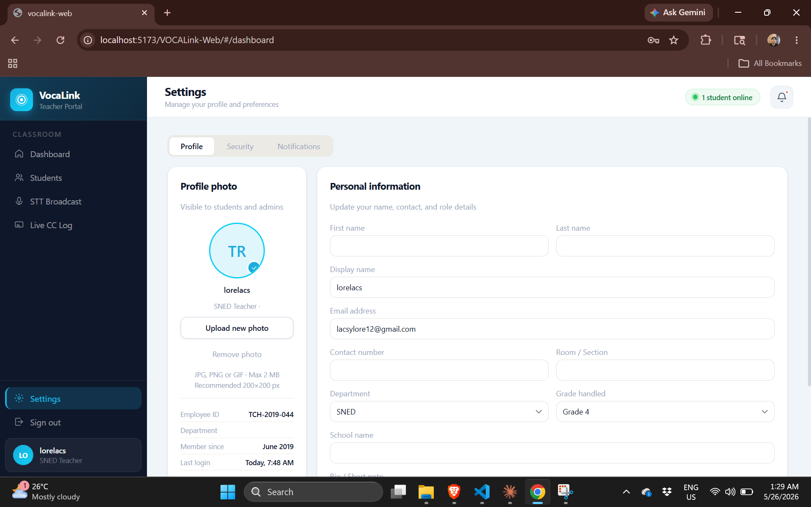

---

*VocaLink — Capstone Project 2026*
*Empowering teachers to connect with nonverbal students through seamless communication.*
